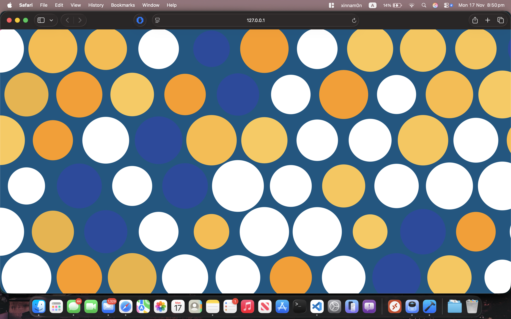
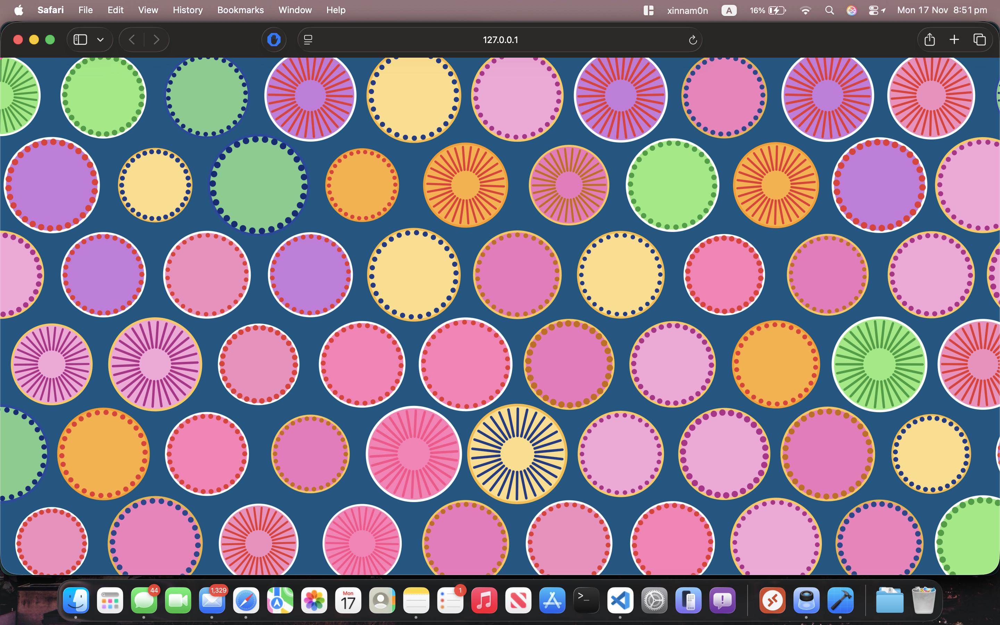
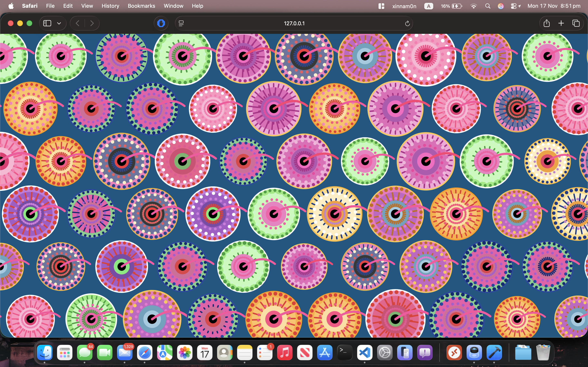
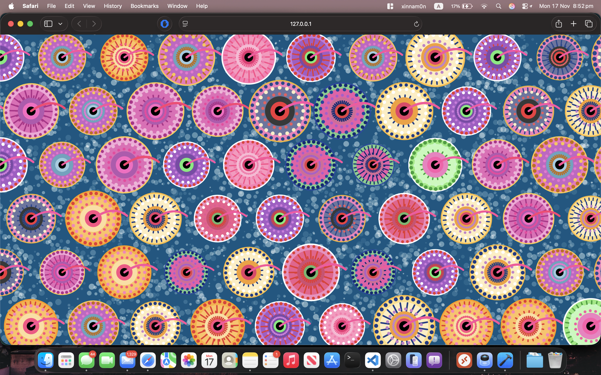

# Design Document — p5.js Interpretation of *Wheels of Fortune*  
*Group Project – 2025*  

---

## **Section 1 – Research and Inspiration**

Our project draws inspiration primarily from **Pacita Abad’s _Wheels of Fortune_**, a vibrant artwork known for its circular motifs, rhythmic dot patterns, and bold colour palettes. The painting’s layered, radial symmetry and celebratory energy guided both our visual and technical decisions.

### **Artistic Inspirations**
- **Pacita Abad’s textile‑like layering**  
  Abad often layered paint in ways resembling embroidery or trapunto quilting. This inspired our multi‑layer wheel structure—each ring containing dots, rays, or colours that emulate stitched textures.

- **Dot‑based Aboriginal and Southeast Asian folk patterns**  
  While not directly referenced in Abad’s original work, the repetition and rhythm of dots in folk art provided additional conceptual support for implementing dot rings and rotational symmetry.

- **Kinetic art and interactive installations**  
  The artwork suggests motion. We referenced kinetic sculptures and rotating mandalas to introduce animation—breathing, spinning layers, and drifting background particles.

The above inspirations share themes of repetition, energy, layered detail, and movement—qualities we sought to reinterpret through p5.js rather than replicate exactly.

---

## **Section 2 – Technical Planning**

Before coding, we outlined a structure emphasising modularity, scalability, and responsiveness:

### **1. Wheel as a Class**
We planned a main `Wheel` class to encapsulate:
- Position  
- Radius  
- Colour palette  
- Three outer pattern layers  
- One inner core pattern  
- Tail/“string” motif  
- Update logic (rotation & breathing)  
- Display logic (whole drawing process)

This approach ensured each wheel was self‑contained, allowing grid‑based layout and responsive scaling.

### **2. Pattern Modules**
To mimic Abad’s multilayered texture:
- `drawDotRing()` for dot-based layers  
- `drawRays()` for radiating strokes  
- `drawPatternLayer()` to abstract each ring’s behaviour  
- `drawTail()` for the curved connecting stems

### **3. Screen-Fitting Strategy**
We chose a **hexagonal packing layout** so the canvas is naturally tiled with wheels. Wheel radius scales based on:
```js
  // Wheel size relative to screen
  let baseR = min(width, height) / 10;      // tweak for density
  let spacingX = baseR * 2;                 // hex packing
  let spacingY = baseR * sqrt(3);

  // Extend area beyond canvas edges to avoid gaps
  let startX = -baseR;
  let startY = -baseR;
  let endX   = width  + baseR;
  let endY   = height + baseR;
```
This ensures:
- Density consistent across all screen sizes  
- No clipping of wheels after window resize  

### **4. Background Layer**
We planned a procedural animated texture—not in the original artwork but an enhancement to evoke depth:
- Thousands of drifting particles  
- Organic motion through slight random directional changes  

### **5. User Interaction**
A simple toggle animation:
- Press **"A"** to pause or resume spinning and breathing.

### **6. Palettes**
A palette generator selects one of several hand‑crafted colour sets based on dominant hues in Abad's painting.

---

## **Section 3 – Implementation and Iteration**

Our development process moved through several iterations:

### **Iteration 1 – Basic Wheel Geometry**



We first created static concentric circles. No animation, no patterns.  
**Goal:** Validate wheel layout, radius scaling, and canvas responsiveness.

### **Iteration 2 – Introducing Dot and Ray Patterns**



We implemented modular functions (`drawDotRing` and `drawRays`).  
**Result:** Visual texture now resembled Abad’s radial motifs.

### **Iteration 3 – Multi‑Layer System**



We added:
- Three outer layers with randomised speeds, colours, and styles  
- Inner rotating pattern

At this stage, each wheel began to feel dynamic and unique.

### **Iteration 4 – Breathing Animation**


Inspired by kinetic art, we introduced:
```js
let s = 1 + sin(this.pulsePhase) * this.pulseAmp;
scale(s);
```
This added subtle organic motion.

### **Iteration 5 – Background Particle Field**


We added thousands of drifting dots to create depth and a textile‑like environment.

### **Iteration 6 – Final Polish**



- Tail/“string” detail  
- More refined palettes  
- Animation toggle  
- Hexagonal spacing adjustments  

Although not every small detail of Abad's original artwork is reproduced, the final design captures its lively spirit through:
- Colour richness  
- Layer density  
- Repetition  
- Rhythmic motion  

---

## **Section 4 – Technical Overview**


### **4.1 File Structure**
```
TUT03_GF_GROUP/
│
├── libraries/
│   ├── p5.min.js               # core p5.js library
│   └── p5.sound.min.js         # p5.js sound library
│
├── readmeImages/               # images used in README.md
│   ├── 1.png
│   ├── 2.png
│   ├── 3.png
│   ├── 4.png
│   ├── 5.png
│   └── 6.png
│
├── index.html                  # main webpage entry point
├── jsconfig.json               # VS Code JS config (optional)
├── README.md                   # documentation & design report
│
├── sketch.js                   # main p5.js code (setup(), draw(), classes)
└── style.css                   # webpage & canvas styling

```

### **4.2 Main Flow**
1. **setup()**  
   - Create canvas  
   - Generate background particles  
   - Initialise wheels  

2. **draw()**  
   - Render textured background  
   - Update & display wheels  

3. **Classes and Functions**  
   - `Wheel` class  
   - Pattern utilities  
   - Layout generator  
   - Input handler  

### **4.3 Key Snippets with Explanations**

#### **Breathing Motion**
```js
let s = 1 + sin(this.pulsePhase) * this.pulseAmp;
scale(s);
```
Creates a smooth scaling effect to simulate breathing, enhancing the organic feel of the wheels.


#### **Dot and Ray Patterns**
```js
for (let i = 0; i < numDots; i++) {
    let angle = TWO_PI / numDots * i + rotationOffset;
    let x = r * cos(angle);
    let y = r * sin(angle);
    ellipse(x, y, dotSize);
}
```
Dot and ray patterns are drawn in circular arrangements. Individual elements are spaced evenly around the circumference and are generated using trigonometric functions. The drawPatternLayer() function calls these snippets with varying parameters to create diverse textures.
```js
  drawPatternLayer(layer) {
    push();
    rotate(layer.angle);

    if (layer.style === "dots") {
      this.drawDotRing(layer.radius, layer.dotSize, layer.dotColor, layer.count);
    } else if (layer.style === "rays") {
      this.drawRays(layer.radius, this.palette.rays, layer.count);
    }

    pop();
  }
```
These methods are used extensively to simulate the dotted texture characteristic of Abad's piece. 


#### **Hexagonal Packing Layout**
```js
let spacingX = baseR * 2;
let spacingY = baseR * sqrt(3);
```
Ensures efficient tiling with no gaps.

#### **Organic Particle Motion Background**
Particles slowly vary direction:
```js
p.speedX += random(-0.02, 0.02);
```
This creates a subtle drifting effect, adding depth and texture to the background.

### **4.4 Tools and External Assistance**
We used:
- p5.js reference
- Online forums for troubleshooting specific coding challenges
- ChatGPT for debugging and explanation assistance

---

## **Section 5 – GitHub Links**

> **Replace the placeholders below with your actual group GitHub links before submission.**

| Name | Unikey | GitHub Repository |
|------|--------|------------------|
| Student 1 | kliu0358 | https://github.com/xinnam0n/kliu0358_9103_TUT03_Majorproject.git |
| Student 2 | tron0999 | https://github.com/PearAccount/tron0999_IDEA9103_TUT3_GroupF_Perlin-noise-and-randomness-Variation |
| Student 3 | yliu0516 | https://github.com/yiting6/yliu0516_9103_tut03 |

---

### **Reference**
The artwork used for inspiration:  
Pacita Abad's Wheels of fortune

---
